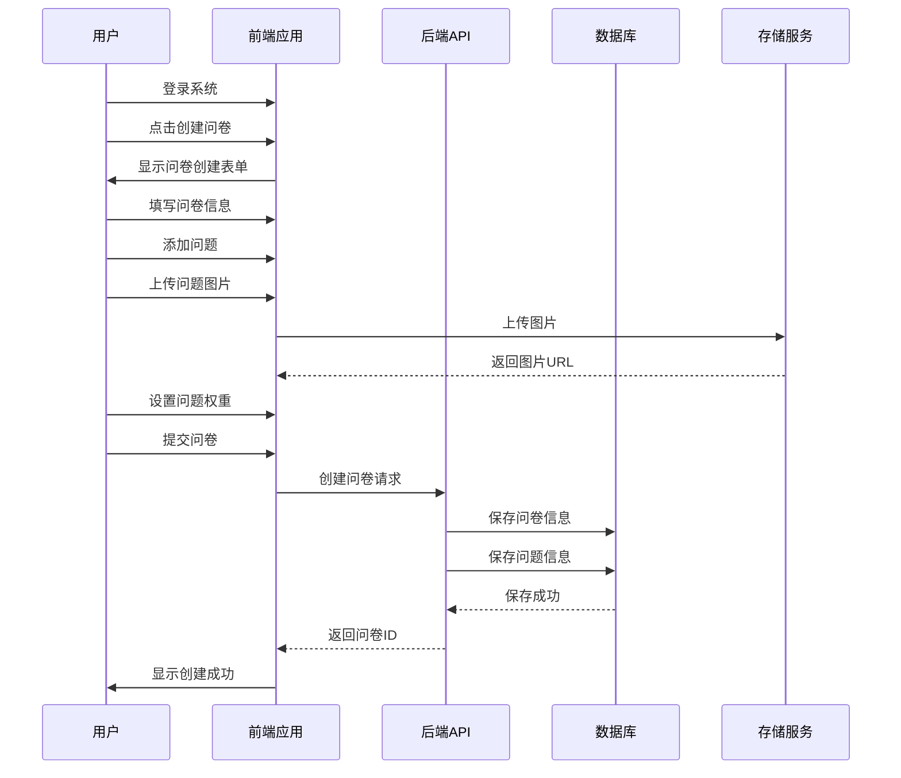
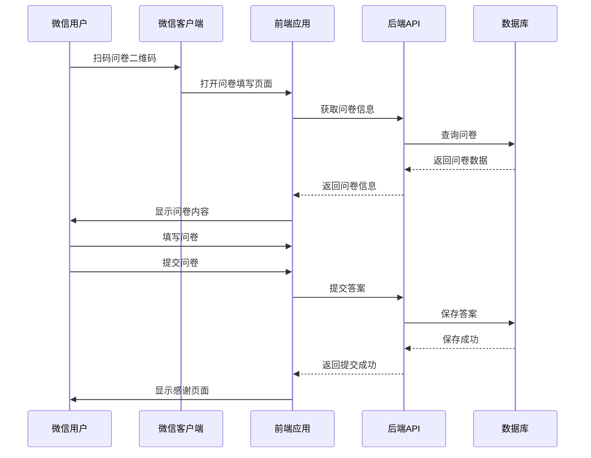
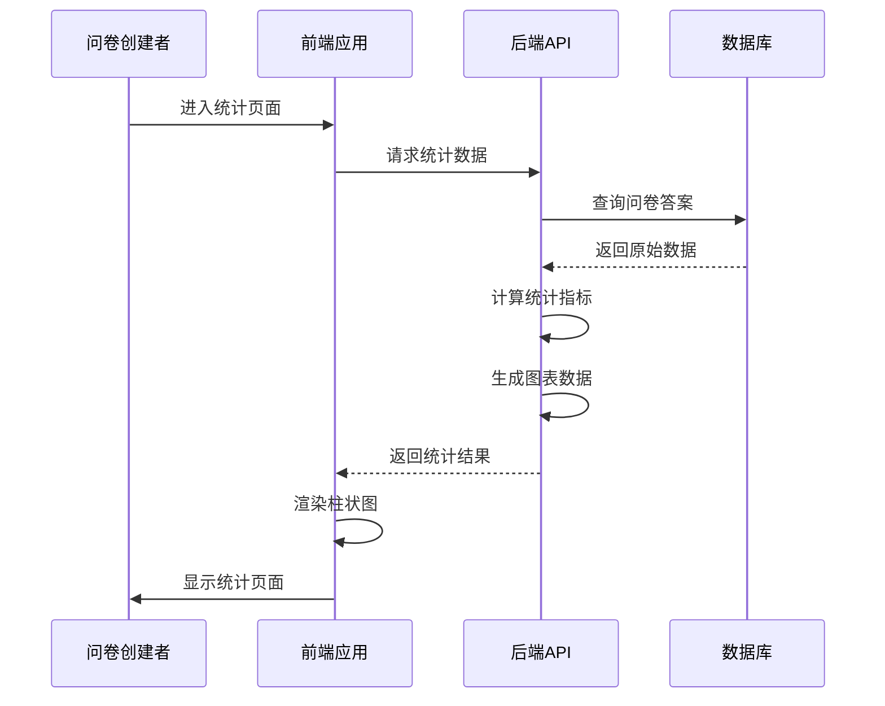

# 调查问卷系统需求文档

## 1. 系统概述

本系统是一个类似问卷星的在线调查问卷平台，支持用户创建、分发、填写和统计调查问卷，重点支持微信扫码填写和问题图片上传功能。

### 1.1 核心功能
- 问卷创建与管理
- 支持问题图片上传
- 分数权重设置
- 二维码分发
- 微信扫码填写
- 数据统计与可视化

### 1.2 目标用户
- 企业管理人员
- 市场调研人员
- 教育工作者
- 需要收集反馈的个人用户

## 2. 功能需求

### 2.1 问卷管理

| 功能点 | 描述 | 优先级 |
|--------|------|--------|
| 问卷创建 | 支持创建新问卷，设置标题、描述和截止时间 | 高 |
| 问题管理 | 支持添加、编辑、删除问题 | 高 |
| 问题类型 | 支持打分题（1-5分制），可扩展至选择题、填空题等 | 高 |
| 分数权重 | 每道题目可设置独立的分数权重 | 高 |
| 图片上传 | 支持在问题中上传和显示图片 | 高 |
| 问卷预览 | 支持实时预览问卷效果 | 中 |
| 问卷复制 | 支持复制现有问卷 | 中 |
| 问卷状态管理 | 支持发布、暂停、关闭问卷 | 高 |

### 2.2 问卷分发

| 功能点 | 描述 | 优先级 |
|--------|------|--------|
| 二维码生成 | 为每个问卷生成唯一二维码 | 高 |
| 微信扫码 | 支持微信扫码直接填写问卷 | 高 |
| 链接分享 | 生成可分享的问卷链接 | 高 |


### 2.3 问卷填写

| 功能点 | 描述 | 优先级 |
|--------|------|--------|
| 微信适配 | 适配微信浏览器环境 | 高 |
| 匿名填写 | 支持匿名填写，自动生成用户标识 | 高 |
| 提交反馈 | 提交后显示感谢页面 | 高 |

### 2.4 数据统计

| 功能点 | 描述 | 优先级 |
|--------|------|--------|
| 实时统计 | 支持实时查看问卷填写进度 | 高 |
| 柱状图展示 | 生成各问题的平均得分柱状图 | 高 |
| 权重计算 | 根据权重计算综合得分 | 高 |


### 2.5 系统管理

| 功能点 | 描述 | 优先级 |
|--------|------|--------|
| 用户认证 | 支持微信登录和账号密码登录 | 高 |

## 3. 非功能需求

### 3.1 性能需求
- 页面加载时间 < 2秒
- 支持并发填写用户数 > 1000
- 统计数据更新延迟 < 5秒

### 3.2 兼容性需求
- 支持微信浏览器（iOS/Android）
- 支持主流浏览器（Chrome、Firefox、Safari、Edge）
- 支持移动端和桌面端

### 3.3 安全性需求
- 数据传输加密（HTTPS）


### 3.4 可用性需求
- 系统可用性 > 99.9%
- 支持7x24小时运行
- 故障恢复时间 < 30分钟

### 3.5 可扩展性需求
- 支持后续扩展更多题型
- 支持第三方系统集成
- 支持多语言扩展

## 4. 数据需求

### 4.1 核心数据模型

#### 4.1.1 问卷表（surveys）
| 字段名 | 数据类型 | 描述 |
|--------|----------|------|
| id | String | 问卷唯一标识 |
| title | String | 问卷标题 |
| description | String | 问卷描述 |
| creator_id | String | 创建者ID |
| status | Enum | 问卷状态（草稿、发布、暂停、关闭） |
| created_at | Timestamp | 创建时间 |
| updated_at | Timestamp | 更新时间 |
| expires_at | Timestamp | 截止时间 |

#### 4.1.2 问题表（questions）
| 字段名 | 数据类型 | 描述 |
|--------|----------|------|
| id | String | 问题唯一标识 |
| survey_id | String | 所属问卷ID |
| content | String | 问题内容 |
| type | Enum | 问题类型（打分题） |
| weight | Float | 分数权重 |
| image_url | String | 问题图片URL |
| order | Integer | 问题排序 |
| created_at | Timestamp | 创建时间 |

#### 4.1.3 回答表（responses）
| 字段名 | 数据类型 | 描述 |
|--------|----------|------|
| id | String | 回答唯一标识 |
| survey_id | String | 问卷ID |
| user_id | String | 用户标识（匿名生成） |
| question_id | String | 问题ID |
| score | Integer | 打分数值（1-5） |
| submitted_at | Timestamp | 提交时间 |

#### 4.1.4 用户表（users）
| 字段名 | 数据类型 | 描述 |
|--------|----------|------|
| id | String | 用户唯一标识 |
| openid | String | 微信OpenID |
| nickname | String | 微信昵称 |
| avatar | String | 微信头像 |
| created_at | Timestamp | 创建时间 |

## 5. 部署需求

### 5.1 部署环境
- 支持Vercel部署
- 支持腾讯云部署

### 5.2 基础设施需求
- 云数据库
- 对象存储服务（用于图片存储）

## 6. 微信生态集成

### 6.1 微信扫码
- 生成符合微信规范的二维码
- 支持微信内直接打开填写
- 适配微信浏览器样式

### 6.2 微信登录
- 支持微信公众号授权登录
- 支持微信小程序登录（可选）

# 技术架构设计

## 1. 技术栈选型

### 1.1 前端技术栈

| 技术 | 版本 | 用途 | 选型理由 |
|------|------|------|----------|
| React | 18.x | 前端框架 | 组件化开发，生态成熟，支持Serverless部署 |
| Next.js | 14.x | 全栈框架 | 支持SSR/SSG，适合Vercel部署，路由管理便捷 |
| Tailwind CSS | 3.x | 样式框架 | 快速开发，响应式设计，适合微信适配 |
| Chart.js | 4.x | 图表库 | 轻量，支持柱状图等多种图表，文档丰富 |
| Axios | 1.x | HTTP客户端 | 异步请求处理，支持拦截器 |

### 1.2 后端技术栈

| 技术 | 版本 | 用途 | 选型理由 |
|------|------|------|----------|
| Node.js | 18.x | 运行环境 | 前后端同构，适合Vercel部署 |
| Next.js API Routes | 14.x | API开发 | 内置API路由，无需额外服务器，适合Serverless |
| Prisma | 5.x | ORM框架 | 类型安全，支持多种数据库，迁移便捷 |
| JWT | - | 认证授权 | 无状态认证，适合Serverless架构 |

### 1.3 数据库

| 数据库 | 类型 | 用途 | 选型理由 |
|--------|------|------|----------|
| PostgreSQL | 关系型 | 主要数据存储 | 支持复杂查询，事务处理，适合统计分析 |
| Supabase | 云数据库 | 数据库服务 | 开源，与Next.js兼容性好，适合Vercel部署 |

### 1.4 存储服务

| 服务 | 用途 | 选型理由 |
|------|------|----------|
| Cloudinary | 图片存储 | 支持图片上传、处理和CDN加速，API友好 |
| AWS S3 | 图片存储 | 高可用，可扩展性强，适合大规模应用 |
| 腾讯云COS | 图片存储 | 国内访问速度快，适合腾讯云部署 |

### 1.5 其他服务

| 服务 | 用途 | 选型理由 |
|------|------|----------|
| QRCode.js | 二维码生成 | 轻量，支持自定义样式，适合前端生成 |
| WeChat JS-SDK | 微信集成 | 官方SDK，支持微信环境功能 |

## 2. 系统架构设计

### 2.1 整体架构

```
┌─────────────────────────────────────────────────────────┐
│                       客户端层                           │
├─────────────────┬─────────────────┬─────────────────────┤
│ 微信浏览器      │ 桌面浏览器      │ 移动浏览器          │
└─────────────────┴─────────────────┴─────────────────────┘
                        │ HTTPS
┌─────────────────────────────────────────────────────────┐
│                       接入层                             │
├─────────────────┬─────────────────┬─────────────────────┤
│ CDN加速         │ SSL证书         │ WAF防护             │
└─────────────────┴─────────────────┴─────────────────────┘
                        │
┌─────────────────────────────────────────────────────────┐
│                       应用层                             │
├─────────────────┬─────────────────┬─────────────────────┤
│ 前端应用        │ API服务         │ 微信集成服务        │
│ (Next.js)       │ (Next.js API)   │ (WeChat JS-SDK)     │
└─────────────────┴─────────────────┴─────────────────────┘
                        │
┌─────────────────────────────────────────────────────────┐
│                       数据层                             │
├─────────────────┬─────────────────┬─────────────────────┤
│ 数据库          │ 存储服务        │ 缓存服务(可选)      │
│ (PostgreSQL)    │ (Cloudinary)    │ (Redis)             │
└─────────────────┴─────────────────┴─────────────────────┘
```

### 2.2 模块架构

```
┌─────────────────────────────────────────────────────────┐
│                     问卷管理模块                         │
├─────────┬─────────┬─────────┬─────────┬─────────┬───────┤
│ 创建    │ 编辑    │ 删除    │ 预览    │ 复制    │ 状态  │
│ 问卷    │ 问卷    │ 问卷    │ 问卷    │ 问卷    │ 管理  │
└─────────┴─────────┴─────────┴─────────┴─────────┴───────┘
                        │
┌─────────────────────────────────────────────────────────┐
│                     问题管理模块                         │
├─────────┬─────────┬─────────┬─────────┬─────────┬───────┤
│ 添加    │ 编辑    │ 删除    │ 设置    │ 上传    │ 排序  │
│ 问题    │ 问题    │ 问题    │ 权重    │ 图片    │ 问题  │
└─────────┴─────────┴─────────┴─────────┴─────────┴───────┘
                        │
┌─────────────────────────────────────────────────────────┐
│                     分发管理模块                         │
├─────────┬─────────┬─────────────────┬─────────────────┤
│ 生成    │ 生成    │ 分享              │
│ 链接    │ 二维码  │ 问卷            │                 │
└─────────┴─────────┴─────────────────┴─────────────────┘
                        │
┌─────────────────────────────────────────────────────────┐
│                     填写模块                             │
├─────────┬─────────┬─────────┬─────────┬─────────────────┤
│ 加载    │ 显示    │ 填写    │ 验证    │ 提交            │
│ 问卷    │ 问题    │ 单选/多选    │ 答案    │ 答案            │
└─────────┴─────────┴─────────┴─────────┴─────────────────┘
                        │
┌─────────────────────────────────────────────────────────┐
│                     统计模块                             │
├─────────┬─────────┬─────────┬─────────┬─────────────────┤
│ 数据    │ 生成    │ 可视化  │ 导出    │ 实时更新         │
│ 收集    │ 报表    │ 图表    │ 数据    │                 │
└─────────┴─────────┴─────────┴─────────┴─────────────────┘
```

## 3. 核心流程设计

### 3.1 问卷创建流程



### 3.2 微信扫码填写流程



### 3.3 数据统计流程



## 4. 部署架构

### 4.1 Vercel部署方案

```
┌─────────────────────────────────────────────────────────┐
│                     Vercel平台                           │
├─────────────────┬─────────────────┬─────────────────────┤
│ 前端应用        │ API服务         │ 边缘函数            │
│ (Next.js SSG/SSR)│ (Next.js API)   │ (Edge Functions)    │
└─────────────────┴─────────────────┴─────────────────────┘
                        │
┌─────────────────────────────────────────────────────────┐
│                     外部服务                             │
├─────────┬─────────────────┬─────────────────────────────┤
│ 数据库  │ 存储服务        │ 其他服务                   │
│ (Supabase) │ (Cloudinary)    │ (微信开放平台)           │
└─────────┴─────────────────┴─────────────────────────────┘
```

### 4.2 腾讯云部署方案

```
┌─────────────────────────────────────────────────────────┐
│                     腾讯云平台                           │
├─────────┬─────────┬─────────┬─────────┬─────────────────┤
│ 负载    │ CDN     │ 对象    │ 云函数  │ 云数据库         │
│ 均衡器  │ 加速    │ 存储COS │ SCF     │ PostgreSQL       │
└─────────┴─────────┴─────────┴─────────┴─────────────────┘
                        │
┌─────────────────────────────────────────────────────────┐
│                     应用层                               │
├─────────────────┬───────────────────────────────────────┤
│ 前端应用        │ 后端服务                               │
│ (Next.js)       │ (Node.js + Express)                   │
└─────────────────┴───────────────────────────────────────┘
```

## 5. 安全性设计

### 5.1 数据安全
- 所有数据传输使用HTTPS加密


### 5.2 防止恶意攻击
- API请求限流
- 防止SQL注入
- 防止XSS攻击
- 图片上传安全验证
- 防止恶意提交和刷票

### 5.3 微信安全
- 微信授权安全验证
- 防止微信钓鱼
- 微信JSSDK安全配置

## 6. 性能优化

### 6.1 前端优化
- 组件懒加载
- 图片优化（压缩、CDN加速、WebP格式）
- 静态资源缓存
- 代码分割

### 6.2 后端优化
- 数据库索引优化
- 查询优化
- API响应缓存
- Serverless函数优化

### 6.3 统计性能
- 预计算统计数据
- 增量更新统计
- 异步处理大数据量


## 8. 实现计划

### 8.1 阶段一：基础架构搭建（2周）
- 初始化Next.js项目
- 配置Prisma和数据库
- 实现用户认证
- 搭建存储服务

### 8.2 阶段二：核心功能开发（3周）
- 问卷创建与管理
- 问题管理与图片上传
- 分数权重设置
- 问卷填写功能

### 8.3 阶段三：分发与统计（2周）
- 二维码生成
- 微信扫码适配
- 数据统计功能
- 柱状图可视化

### 8.4 阶段四：测试与优化（1周）
- 功能测试
- 性能优化
- 安全性测试
- 微信环境测试

### 8.5 阶段五：部署上线（1周）
- Vercel部署
- 腾讯云部署（可选）
- 上线前检查
- 正式发布

## 9. 风险评估与应对

| 风险点 | 可能性 | 影响程度 | 应对措施 |
|--------|--------|----------|----------|
| 微信浏览器兼容性问题 | 中 | 高 | 提前进行微信环境测试，使用微信开发者工具 |
| 图片上传性能问题 | 中 | 中 | 使用CDN加速，优化图片压缩算法 |
| 统计数据量大时性能问题 | 低 | 高 | 实现预计算和增量更新，优化查询语句 |
| 部署环境限制 | 中 | 中 | 选择灵活的技术栈，支持多种部署方式 |
| 恶意提交风险 | 中 | 中 | 实现防刷机制，IP限制，验证码等 |

## 10. 后续扩展计划

1. 支持更多题型（选择题、填空题等）
2. 添加问卷模板库
3. 支持多语言
4. 实现高级统计分析功能
5. 支持导出PDF/Excel报告
6. 开发微信小程序版本
7. 支持第三方系统集成
8. 添加AI智能分析功能

# 总结

本技术架构设计基于Next.js全栈框架，适合Serverless部署，特别是Vercel平台。采用前后端分离的设计思想，同时兼顾微信环境兼容性。数据库选择PostgreSQL，适合复杂的统计查询。存储服务使用Cloudinary或腾讯云COS，确保图片上传和访问性能。

系统架构具有良好的可扩展性，支持后续功能扩展和多平台部署。通过合理的性能优化和安全设计，确保系统在高并发情况下仍能稳定运行。

该设计充分考虑了用户需求和部署环境，是一个完整、可行的技术方案。